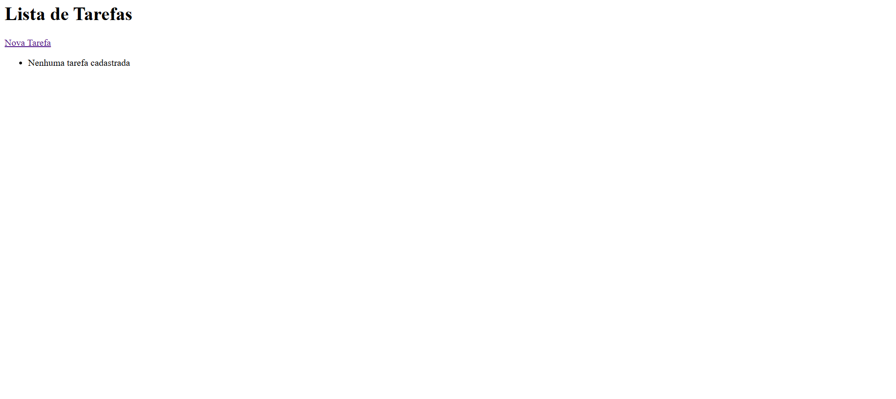
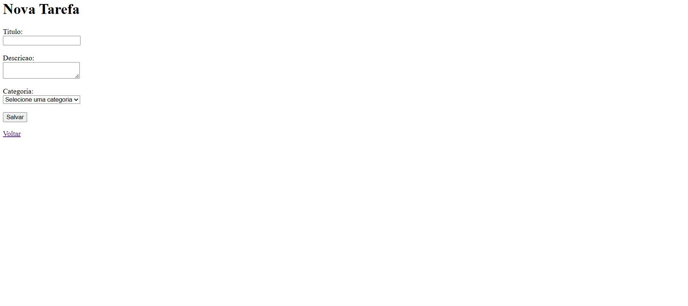
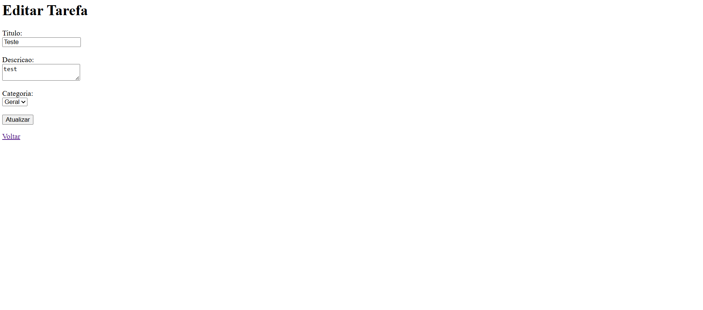

# Sistema de Gerenciamento de Tarefas

Um sistema simples para organizar e gerenciar suas tarefas do dia a dia.

## O que é?

É um aplicativo web que permite criar, editar, deletar e organizar tarefas por categorias. Você pode adicionar um título, uma descrição e escolher em qual categoria a tarefa pertence.

## O que você precisa?

- Python 3.x
- Django 6.0
- Um navegador web (Chrome, Firefox, Edge, etc)

## Como usar?

1. Abra o terminal na pasta do projeto
2. Execute o comando para iniciar o servidor: python manage.py runserver
3. Acesse no navegador em http://127.0.0.1:8000/
4. Pronto! Você já pode criar e gerenciar suas tarefas

## Funcionalidades

- **Listar tarefas**: Ver todas as tarefas cadastradas na tela principal
- **Criar tarefa**: Adicionar uma nova tarefa com título, descrição e categoria
- **Editar tarefa**: Modificar uma tarefa que já existe
- **Deletar tarefa**: Remover uma tarefa que não precisa mais
- **Categorizar**: Organizar tarefas por categorias

## Como funciona?

O sistema tem duas tabelas principais:

**Categorias**: Armazena os tipos de categorias (Trabalho, Pessoal, Estudos, etc)

**Tarefas**: Armazena as tarefas com título, descrição e qual categoria pertence

Cada tarefa deve ter uma categoria. Se não quiser selecionar nenhuma, a tarefa fica sem categoria.

## Validação de dados

O sistema verifica se:
- O título da tarefa não está vazio
- A descrição da tarefa não está vazia
- Uma categoria foi selecionada

Se algo estiver faltando, o sistema mostra uma mensagem de erro.

## Tratamento de erros

Se algo der errado durante a operação, o sistema mostra uma mensagem clara do que aconteceu, sem travar a aplicação.

## Estrutura da pasta

```
projeto/
├── manage.py (arquivo para gerenciar Django)
├── db.sqlite3 (banco de dados)
├── projeto/ (configurações gerais)
│   └── urls.py (rotas principais)
└── tarefas/ (aplicação principal)
    ├── models.py (Categoria e Tarefa)
    ├── views.py (lógica do sistema)
    ├── urls.py (rotas da aplicação)
    └── templates/ (páginas HTML)
```

## Capturas de tela




---

Desenvolvido como projeto final de aprendizado de Python e Django.
